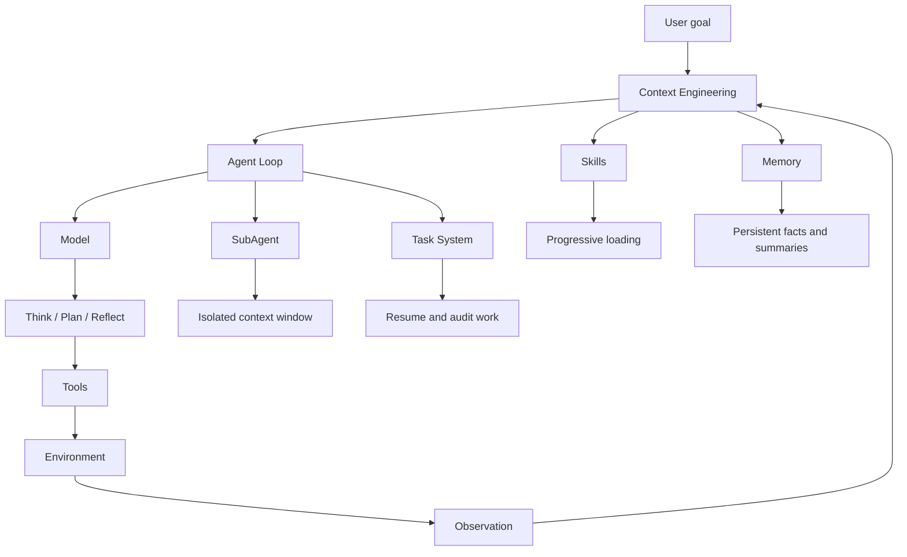

# Harness Agent Concept Map

## Core Relationships

- **Prompt Engineering** improves a single instruction.
- **Context Engineering** designs what information enters the model at each step.
- **Harness Engineering** designs the surrounding system that lets the model act, persist, recover, and collaborate.
- **Agent Loop** is the runtime cycle: decide, call tool, observe, update context, continue.
- **Skills** are reusable expert packages that avoid loading all knowledge upfront.
- **Memory** keeps relevant facts after the immediate context window is gone.
- **SubAgent** keeps noisy execution details out of the main agent context.
- **Task System** turns transient conversation into resumable work.

## Agent Types

| Type | Main Capability | Limitation |
| --- | --- | --- |
| Chatbot | Responds in one conversational context | Cannot reliably act in the environment |
| Tool Agent | Calls predefined tools | Tool descriptions and observations can pollute context |
| Code Agent | Uses code or shell as a general action layer | Needs safety, state, and context management |
| Harness Agent | Combines loop, tools, context, skills, memory, tasks, and subagents | Requires engineering discipline around boundaries and failure modes |
