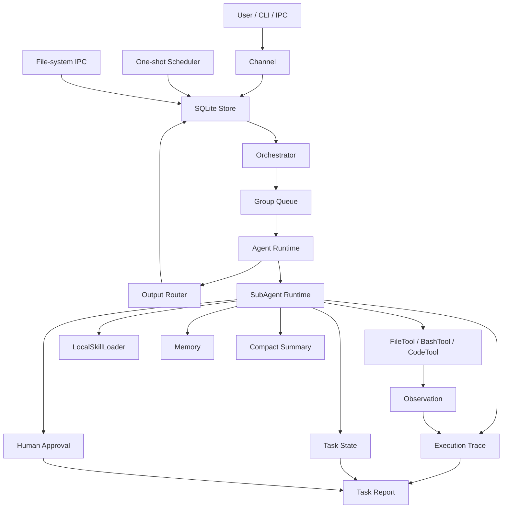

# MiniClaw 架构视图

MiniClaw 的学习价值在于：它把 Agent 从一次模型调用，变成一个有入口、状态、工具、任务、恢复和证据的 Harness 系统。

这份文档不是版本日志，而是读代码前的结构地图。

## 总图



## 三层结构

### 1. 产品壳

产品壳负责让 Agent 像一个可运行系统，而不是一次函数调用。

对应代码：

- `prototypes/miniclaw_harness/main.py`：CLI 入口。
- `prototypes/miniclaw_harness/src/miniclaw_harness/channel.py`：本地消息入口。
- `prototypes/miniclaw_harness/src/miniclaw_harness/store.py`：SQLite 持久化。
- `prototypes/miniclaw_harness/src/miniclaw_harness/orchestrator.py`：取消息、排队、调用 runtime。
- `prototypes/miniclaw_harness/src/miniclaw_harness/queue.py`：按 group 串行化工作。
- `prototypes/miniclaw_harness/src/miniclaw_harness/scheduler.py`：一次性计划任务。
- `prototypes/miniclaw_harness/src/miniclaw_harness/router.py`：输出写回 store。
- `prototypes/miniclaw_harness/src/miniclaw_harness/ipc.py`：文件系统 IPC。

这一层回答的问题是：用户输入如何进入系统、任务如何排队、结果如何回到可检查的地方。

### 2. Agent 运行时

运行时负责把输入变成行动，并决定什么时候调用模型、工具或 SubAgent。

对应代码：

- `LocalAgentRuntime`：离线确定性 runtime。
- `ModelBackedRuntime`：真实模型适配边界。
- `SubAgentRuntime`：隔离任务上下文的主要学习对象。

核心逻辑在：

- `prototypes/miniclaw_harness/src/miniclaw_harness/runtime.py`

这一层回答的问题是：Agent 如何从 intent 进入 plan、decision、tool_call、observation、final_result。

## Agent Loop

MiniClaw 的最小可观察 Agent Loop 是：

```text
plan -> decision -> tool_call -> observation -> final_result
```

在 `trace-show <task-id>` 中可以看到这些事件。

一次仓库分析任务会扩展为：

```text
list_files -> read_file -> run_tests -> summarize
```

这说明 Harness Agent 不是“模型直接回答”，而是持续把任务拆成可执行动作，并把每次观察写入 trace。

## 工具边界

工具是模型外部的行动边界。MiniClaw 目前有三种工具：

- `FileTool`：列文件、读文件，并阻止 workspace escape。
- `BashTool`：只执行 allowlist 命令，不使用 unrestricted shell，并在观察结果中暴露 `shell=False`、`cwd=workspace`、`allowlist=matched` 这类边界证据。
- `CodeTool`：执行受限 Python 子集，阻止 import、open、eval 等危险能力，并把 `imports=blocked`、`builtins=empty` 写入 CodeAct state。

对应代码：

- `prototypes/miniclaw_harness/src/miniclaw_harness/tools.py`

工具层回答的问题是：Agent 能做什么、不能做什么、风险在哪里被拦住。

## Context、Trace、State、Memory

MiniClaw 把上下文拆成四类，不把所有东西都塞回 prompt。

- Trace：过程证据，适合审计。
- State：恢复任务所需的结构化状态。
- Memory：完成后可复用的长期经验。
- Compact Summary：trace 过长后的压缩摘要。

对应 CLI：

```bash
python3 prototypes/miniclaw_harness/main.py trace-show <task-id>
python3 prototypes/miniclaw_harness/main.py state-show <task-id>
python3 prototypes/miniclaw_harness/main.py memory-list repo
python3 prototypes/miniclaw_harness/main.py compact-task <task-id>
```

这一层回答的问题是：上下文什么时候留在过程里，什么时候沉淀成状态，什么时候进入长期记忆。

## Skills

MiniClaw 的 Skill 加载体现渐进上下文：

1. 先读取 Skill 标签和描述。
2. 任务匹配后再加载完整 `SKILL.md`。
3. 加载结果写入 trace 和 task state。

对应代码：

- `prototypes/miniclaw_harness/src/miniclaw_harness/skills.py`
- `prototypes/minimal_harness_agent/skills/repo-reading/SKILL.md`

Skills 回答的问题是：专家经验如何作为上下文包按需进入，而不是每轮都塞进 prompt。

## Task System

MiniClaw 的任务系统让长任务可管理、可恢复、可报告。

能力包括：

- background task
- persisted task state
- resume task
- blocked recovery
- approval request
- task report

对应代码：

- `prototypes/miniclaw_harness/src/miniclaw_harness/background.py`
- `prototypes/miniclaw_harness/src/miniclaw_harness/store.py`
- `prototypes/miniclaw_harness/main.py`

对应 CLI：

```bash
python3 prototypes/miniclaw_harness/main.py background-list
python3 prototypes/miniclaw_harness/main.py background-show <task-id>
python3 prototypes/miniclaw_harness/main.py resume-task <task-id>
python3 prototypes/miniclaw_harness/main.py approve-task <task-id>
python3 prototypes/miniclaw_harness/main.py task-report <task-id>
```

Task System 回答的问题是：Agent 如何从一次会话变成可以中断、恢复、审计的工作系统。

## 推荐读代码顺序

1. `prototypes/miniclaw_harness/main.py`

   先看 CLI 暴露了哪些能力。

2. `prototypes/miniclaw_harness/src/miniclaw_harness/app.py`

   看 MiniClawApp 如何装配 store、channel、queue、runtime、router。

3. `prototypes/miniclaw_harness/src/miniclaw_harness/orchestrator.py`

   看消息如何进入 runtime。

4. `prototypes/miniclaw_harness/src/miniclaw_harness/runtime.py`

   看 Local、ModelBacked、SubAgent 三种 runtime。

5. `prototypes/miniclaw_harness/src/miniclaw_harness/tools.py`

   看工具边界如何限制行动能力。

6. `prototypes/miniclaw_harness/src/miniclaw_harness/store.py`

   看 trace、state、memory、approval 如何持久化。

7. `prototypes/miniclaw_harness/tests/test_miniclaw_harness.py`

   用测试理解每个机制的验收场景。

## 一句话记住

MiniClaw 的核心不是“实现一个聊天机器人”，而是把模型放进一个可行动、可约束、可恢复、可审计的 Harness 里。
