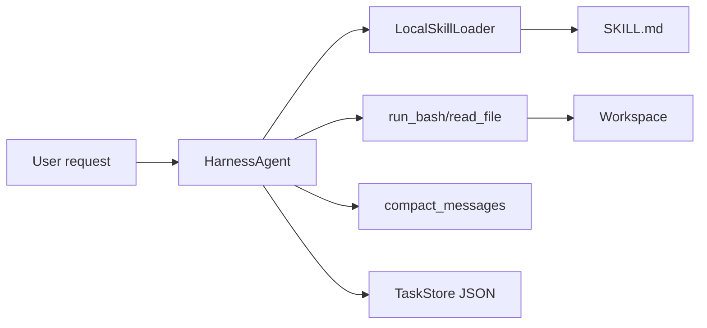

# Minimal Harness Agent Prototype

This prototype demonstrates Harness Agent mechanics. The default tests are offline, and an optional integration test can call a real model.

## What It Demonstrates

- Agent Loop as a multi-step workflow.
- Safe-ish shell observation through a constrained Bash tool.
- File reading as a basic environment tool.
- Skill labels first, full Skill loading only when selected.
- Context compacting for older messages.
- JSON task persistence for resumable work.
- Plan-Act, Reflection, and CodeAct as small deterministic pattern demos.
- Optional real-model smoke testing through the OpenAI Responses API.

## What It Does Not Do

- It does not require a real model for the default test suite.
- It does not implement production-grade sandboxing.
- It does not implement full SubAgent, DeepResearch, Mem0, or OpenClaw behavior.
- CodeAct is a learning demo, not a secure execution sandbox.

## Run Tests

```bash
python3 -m unittest discover -s prototypes/minimal_harness_agent/tests -v
```

## Run Real Model Smoke Test

This calls the OpenAI Responses API. It is skipped by default so local verification remains cheap and does not require credentials.

```bash
RUN_REAL_MODEL_TESTS=1 OPENAI_API_KEY=your_key python3 -m unittest discover -s prototypes/minimal_harness_agent/tests -v
```

Optional:

```bash
OPENAI_MODEL=gpt-5.4-mini
```

## Run Demo

```bash
python3 prototypes/minimal_harness_agent/demo.py
```

Expected behavior:

- The agent loads the `repo-reading` Skill.
- It observes files in the workspace.
- It writes task state to `prototypes/minimal_harness_agent/.demo_state/tasks.json`.
- It prints a short report showing the final loop state.

## Architecture


