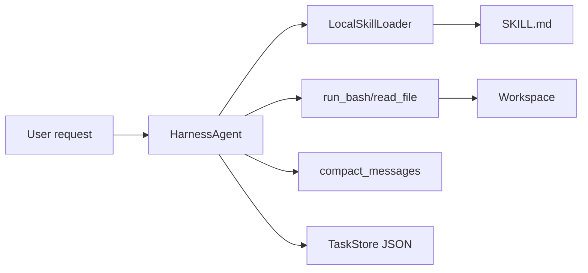

# Minimal Harness Agent Prototype

This prototype demonstrates Harness Agent mechanics without requiring a live LLM API.

## What It Demonstrates

- Agent Loop as a multi-step workflow.
- Safe-ish shell observation through a constrained Bash tool.
- File reading as a basic environment tool.
- Skill labels first, full Skill loading only when selected.
- Context compacting for older messages.
- JSON task persistence for resumable work.
- Plan-Act, Reflection, and CodeAct as small deterministic pattern demos.

## What It Does Not Do

- It does not call a real model.
- It does not implement production-grade sandboxing.
- It does not implement full SubAgent, DeepResearch, Mem0, or OpenClaw behavior.
- CodeAct is a learning demo, not a secure execution sandbox.

## Run Tests

```bash
python3 -m unittest discover -s prototypes/minimal_harness_agent/tests -v
```

## Run Demo

```bash
python3 prototypes/minimal_harness_agent/demo.py
```

Expected behavior:

- The agent loads the `repo-reading` Skill.
- It observes files in the workspace.
- It writes task state to `prototypes/minimal_harness_agent/.demo_state/tasks.json`.
- It prints a short report showing the final loop state.

## Architecture


